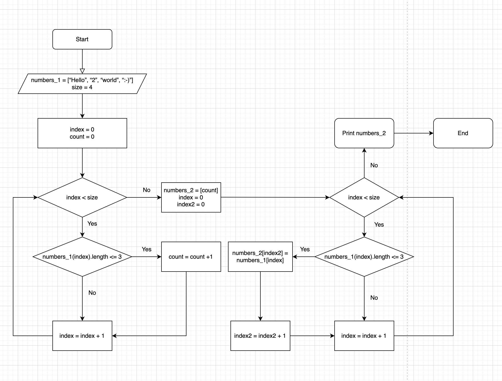

#  Итоговая контрольная работа по основному блоку
*Задача. Написать программу, которая из имеющегося массива строк формирует новый массив из строк, длина которых меньше, либо равна 3 символам. Первоначальный массив можно ввести с клавиатуры, либо задать на старте выполнения алгоритма. При решении не рекомендуется пользоваться коллекциями, лучше обойтись исключительно массивами.*

Перед написанием кода излагаем все действия в блок-схеме:

1. Первым действием просим пользователя ввести в консоль элементы массива посредством конструкций ***Console.WriteLine("Введите элементы массива:")*** и ***string input = Console.ReadLine()***
2. Далее с помощью функции ***.split*** разделяем исходный массив на элементы по пробелу. 
3. Следующей частью кода через счетчик определяем количество элементов массива, размер которых не превышает 3. Делаем это через чикл ***for***, пробегая по всем элементам заданного массива
4. Создаем новый массив ***resultArray***, число элементов которого будет равно количеству элементов изначального массива, меньших или равных 3 (счетчик count)
5. Используя цикл ***for***, снова пробегаем исходный массив, на этот раз записывая все его элементы, длина которых меньше или равна 3, в новый массив  ***resultArray***
6. Выводим на печать через запятую все элементы нового массива в соответствии с условиями задачи.